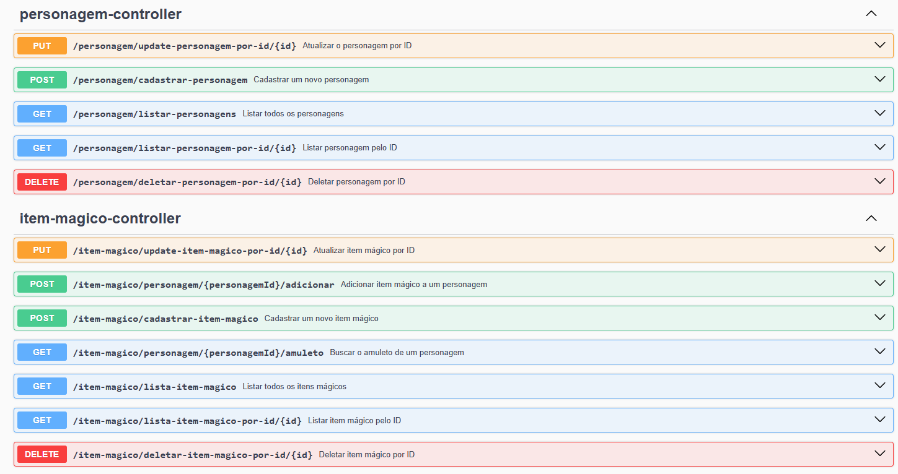

# Explicando o CRUD

Todas as rotas feitas em swagger:
````http://localhost:8080/swagger-ui/index.html#/````

# Atividade CRUD (Problemática)
Data Limite Entrega: 23:59 13/Abril/2025.
Segue abaixo o detalhamento sobre a Atividade Prática de CRUD.

## Definições
A atividade em questão não será um acréscimo de nota (EXTRA), será um percentual que será descontado da nota final do Aluno, ou seja, a nota máxima é 0% e a mínima é 25%.

Não será obrigatório o uso de uma linguagem específica, muito menos das máquinas da Unicesumar. Porém será proibido o uso de ferramentas de IA (Chat GPT por exemplo), caso o aluno utilize alguma dessas ferramentas, a nota será 25% instantaneamente.

Envio por meio de Forms disponibilizado no dia 08/Abr,a entrega tem de ser realizada dentro do período de aplicação da avaliação (08/Abr - 13/Abr). Qualquer entrega posterior a isso será desconsiderado e a nota será considerada como 25%.

Será obrigatório o uso de um repositório do GitHub para a entrega da avaliação, bem como a aplicação dos conceitos de POO.

A atividade é **INDIVIDUAL**, entregas iguais ou códigos copiados de repositórios, serão consideradas Plágio.

## Critérios de Avaliação
- 00% - CRUD funcional, solucionando o problema solicitado, aplicando as métricas solicitadas;
- 05% - CRUD funcional, solucionando o problema solicitado, sem aplicar de maneira congruente as métricas solicitadas;
- 10% - CRUD funcional, solucionando o problema solicitado, sem aplicar nada das métricas solicitadas;
- 25% - CRUD não funcional, aplicando as métricas solicitadas;
- 25% - CRUD não funcional, sem aplicar de maneira congruente as métricas solicitadas;
- 25% - CRUD não funcional, sem aplicar nada das métricas solicitadas;

Lembrando que o descumprimento das obrigatoriedades do enunciado serão consideradas 25%.

## Problemática
Você foi contratado para desenvolver um sistema de gerenciamento para um jogo de RPG (Role-Playing Game). O sistema deve permitir o gerenciamento de Personagens e Itens Mágicos. Cada personagem pode carregar vários itens mágicos, e cada item mágico está vinculado a um personagem.
### Entidades e Atributos
#### Personagem
Descrição da Entidade Personagem, com definições e Atributos.
#### Definições
Na criação do Personagem ele terá 10 pontos para Distribuir entre Força e Defesa, do jeito que desejar, não passando dos 10 pontos disponíveis (ex: 5-5, 6-4, 10-0). Os valores serão apresentados nas informações do Personagem e devem considerar os Itens Mágicos do Personagem, somando a força e a defesa dos itens do Personagem para exibição.
As classes somente serão essas Listadas, não podendo existir Personagens com outras classes vinculadas.
Na exibição dos dados do Personagem, os atributos Força e Defesa, consideram os valores dos Itens Mágicos, que devem ser somados aos valores do Personagem.
O Personagem só pode possuir 1 Item Mágico do tipo Amuleto.
#### Atributos do Personagem
- Identificador;
- Nome;
- Nome Aventureiro;
- Classe (Guerreiro, Mago, Arqueiro, Ladino ou Bardo)
- Level;
- Lista de Itens Mágicos;
- Força;
- Defesa;
#### Item Mágico
Descrição da Entidade Item Mágico, com definições e Atributos.
#### Definições
Os Tipos do Item somente serão esses Listadas, não podendo existir Itens Mágicos com outros tipos vinculados.
Quando um Item for do Tipo Arma, a Defesa dele será OBRIGATORIAMENTE zero.
Quando um Item for do Tipo Armadura, a Força dele será OBRIGATORIAMENTE zero.
Quando um Item for do Tipo Amuleto, ele poderá ter Força e Defesa, porém o Personagem só pode possuir 1 Item Mágico do tipo Amuleto.
Os atributos Força e Defesa, podem ser no máximo 10.
Não podem existir Itens com zero de Defesa e zero de Força.
#### Atributos Item Mágico
- Identificador;
- Nome;
- Tipo do Item (Arma, Armadura e Amuleto);
- Força;
- Defesa;
### Features
Serão necessários os mapeamentos abaixo (Entrega dessa documentação por Swagger, ReadMe ou similares).

- Cadastrar Personagem;
- Cadastrar Item Mágico;
- Listar Personagem;
- Buscar Personagem por Identificador;
- Atualizar Nome Aventureiro por Identificador;
- Remover Personagem;
- Adicionar Item Mágico;
- Listar Itens Mágicos;
- Buscar Item Mágico por Identificador;
- Adicionar Item Mágico ao Personagem;
- Listar Itens Mágicos por Personagem;
- Remover Item Mágico do Personagem;
- Buscar Amuleto do Personagem;
